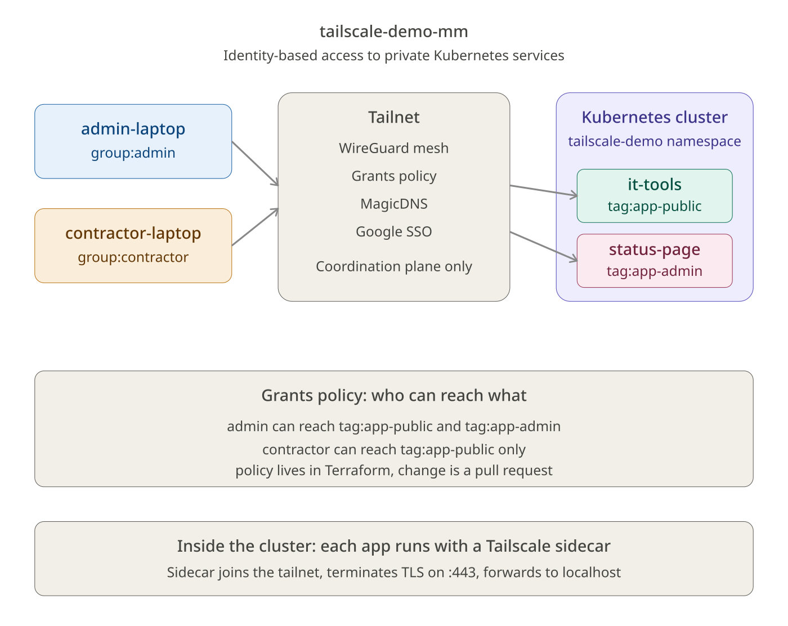
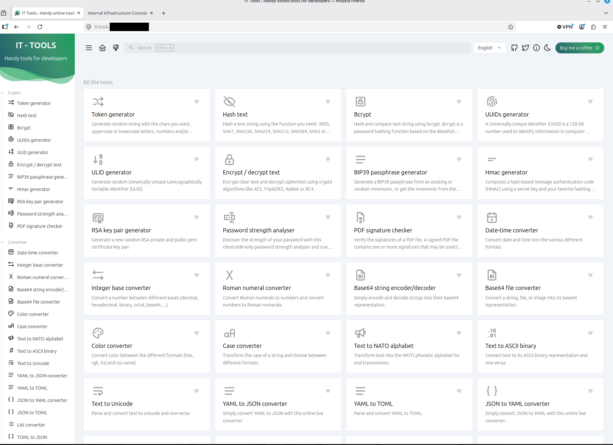
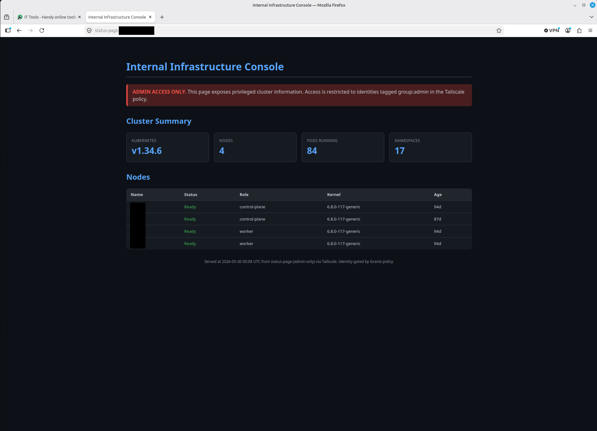
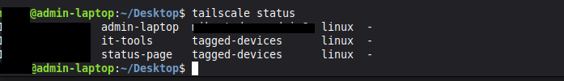
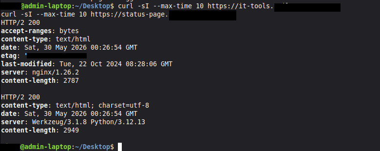
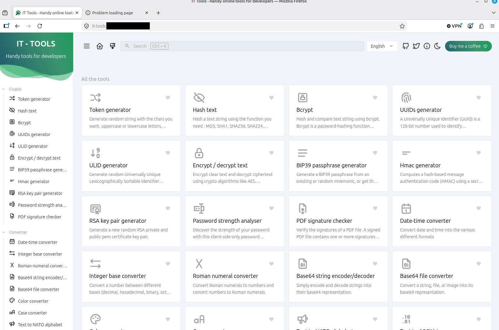
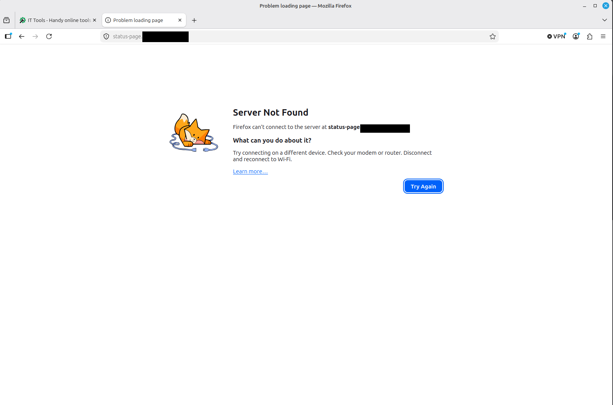
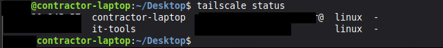
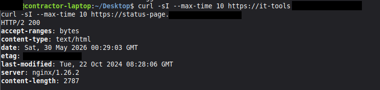
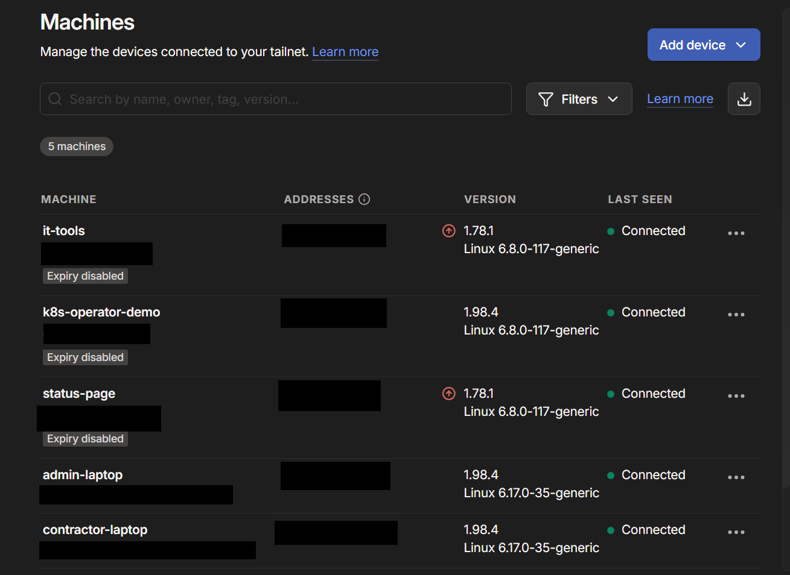

# tailscale-demo-mm

Identity-based access to private Kubernetes services, using Tailscale instead of a public ingress and a bastion host.

This repository is a take-home exercise for the Tailscale Solutions Engineering interview. It demonstrates a pattern, explains the trade-offs, and is reproducible end-to-end.

## What this is

Two services running in a Kubernetes cluster, exposed to a tailnet, not to the public internet. Two identities on the tailnet: one with admin access to both services, one with contractor-level access to just one. A revocation moment that takes seconds, not a ticket queue.

The pattern is **identity-based remote access to internal services**, which replaces the conventional "public DNS + TLS cert + WAF + ingress + bastion + VPN + SSH" stack for tools that have no business being on the public internet in the first place.

## Why this use case

I picked this scenario because it maps to a real, recurring problem I've watched platform teams handle badly: exposing internal tools safely. Every company has internal dashboards, admin consoles, and developer utilities that should only be reachable by a small group of people. The default playbook for these tools today is one of three things, all of them flawed:

1. **Put it behind a public ingress with auth in front.** Now you're managing certs, watching access logs for scanning bots, and trusting your app's auth implementation against the entire internet.
2. **Put it behind a VPN.** Now you're managing VPN clients, OS-specific quirks, IP allowlists, and the unspoken assumption that "on the network" means "trusted."
3. **Put it behind a bastion.** Now you're managing SSH keys, sudoers files, jump-host hygiene, and the same network-trust assumption.

All three approaches share the same root weakness: they grant access based on where a packet came from, not who sent it. Tailscale flips that. Access is granted to identities, not networks. That's the substance of the demo.

I deliberately did not pick a CI/CD use case or a multi-cloud connectivity use case, both of which are excellent Tailscale stories. I picked the simplest, most common enterprise pain point I could explain in one sentence, and built exactly that.

## Architecture



Two services run in a Kubernetes namespace (`tailscale-demo`):

- **it-tools**, an open-source collection of developer utilities (JSON formatters, regex testers, hash generators). Stands in for any "low-sensitivity internal tool." Tagged `tag:app-public`.
- **status-page**, a small custom dashboard showing cluster health. Stands in for "privileged internal tool." Tagged `tag:app-admin`.

Each service is exposed to the tailnet by the **Tailscale Kubernetes Operator**, which runs a small proxy pod per service. The proxy joins the tailnet as a node and forwards traffic to the underlying Kubernetes Service. The services themselves have **no Ingress, no LoadBalancer of type external, no public DNS record, no TLS certificate from a public CA.** They are not reachable from the internet.

Two human identities exist on the tailnet:

- **admin**, full access to both services
- **contractor**, access to `it-tools` only

Access is controlled by a single **Grants** policy file (Tailscale's modern, recommended successor to ACLs) managed in Terraform. The policy uses tag-based addressing for services and group-based addressing for users. Adding or removing a user from a group is the entirety of access management.

### How traffic flows

When `admin` opens `https://it-tools.<tailnet>.ts.net` on their laptop:

1. The laptop's Tailscale client resolves the MagicDNS name to the IP of the it-tools proxy pod (in the 100.64.0.0/10 CGNAT range).
2. The Tailscale coordination server confirms, based on the Grants policy, that `admin` is permitted to reach `tag:app-public`. If not, the connection is refused before any packet leaves the laptop.
3. WireGuard establishes a direct, end-to-end-encrypted tunnel between the laptop and the proxy pod. Where direct connection isn't possible (NAT, restrictive firewall), Tailscale falls back to a DERP relay; either way the traffic is encrypted end-to-end with keys neither Tailscale nor the relay can see.
4. The proxy pod forwards the connection to the underlying Kubernetes Service, which forwards it to the application pod.

Same flow for `contractor` to `it-tools`. For `contractor` to `status-page`, the connection is refused at step 2, no packets are sent.

## What you'll need to reproduce this

| Requirement | Notes |
|---|---|
| A Kubernetes cluster | Any cluster works. I built this on a homelab cluster (v1.34.6, containerd 2.2.1) but the manifests are vanilla. |
| `kubectl`, `helm`, `terraform` | All recent versions. |
| A Tailscale account | Free tier is sufficient. Up to 3 users and 100 devices. |
| A Google account for SSO | Tailscale uses your IdP. I used Google. GitHub, Microsoft, Okta, and others work identically. |
| ~30 minutes | Roughly evenly split between Terraform, Helm, and verification. |

## Setup

The setup is wrapped in a `Makefile`. The commands below show what each step actually does.

### 1. Configure secrets locally

```bash
cp terraform/terraform.tfvars.example terraform/terraform.tfvars
# Edit terraform/terraform.tfvars with your values
```

You'll need:

- `tailnet_name`, your tailnet's name (visible in the Tailscale admin console)
- `tailscale_oauth_client_id` and `tailscale_oauth_client_secret`, generated in the Tailscale admin console under Settings, then OAuth Clients
- `admin_emails`, list of email addresses for the admin group
- `contractor_emails`, list of email addresses for the contractor group

The OAuth client is used by Terraform to manage the tailnet's policy file and to generate the auth key the Kubernetes Operator uses to join the tailnet.

### 2. Apply the Tailscale configuration

```bash
make tailnet
```

This runs `terraform apply` against the `tailscale/tailscale` Terraform provider, which writes:

- The Grants policy (defines who can reach what)
- Tag owners (`tag:app-public`, `tag:app-admin`, `tag:k8s-operator`)
- The user groups (`group:admin`, `group:contractor`)
- An auth key for the operator (tagged `tag:k8s-operator`, time-limited)

The auth key is written to a Kubernetes Secret manifest at `kubernetes/operator/operator-secret.yaml`, which is gitignored.

### 3. Install the Tailscale Kubernetes Operator

```bash
make operator
```

This installs the operator via Helm into the `tailscale` namespace, using the auth key from step 2. The operator immediately joins the tailnet as `k8s-operator-<cluster-name>`.

### 4. Deploy the demo applications

```bash
make apps
```

This applies the manifests in `kubernetes/apps/`:

- A namespace `tailscale-demo` with a default-deny NetworkPolicy
- The `it-tools` Deployment and Service
- The `status-page` Deployment and Service (built from `apps/status-page/`)
- Tailscale ingress annotations on each Service, which signal the operator to create a proxy pod and join it to the tailnet with the correct tag

Within a minute, both services appear as nodes in the Tailscale admin console.

## How to validate it works

The repo includes `tests/verify.sh`, which automates the validation steps below. Run it after deployment:

```bash
make verify
```

The script checks:

1. Both apps appear in the tailnet device list (via the Tailscale API)
2. Both apps have the expected tags applied
3. The admin user can reach both apps (HTTP 200 from both MagicDNS names)
4. The contractor user is denied at the network layer when targeting `status-page` (connection refused, *not* HTTP 403)

If you'd rather do it manually, here's what to look for:

```bash
# From the admin laptop
tailscale status                                          # Both apps should appear
curl https://it-tools.<tailnet>.ts.net                    # 200
curl https://status-page.<tailnet>.ts.net                 # 200

# From the contractor laptop
tailscale status                                          # it-tools visible, status-page filtered out
curl https://it-tools.<tailnet>.ts.net                    # 200
curl https://status-page.<tailnet>.ts.net                 # Connection refused, not an HTTP error
```

The difference between "HTTP 403" and "connection refused" is the substance of the demo. With a traditional reverse proxy, the request reaches the server and the server says no. With Tailscale Grants, the packet never leaves the contractor's laptop. The denial is enforced at the network layer, before any application sees the traffic.

### Validation evidence

Screenshots captured during a working deployment, with tailnet names and account identifiers redacted:

**Admin identity reaches both apps:**


*it-tools rendered in admin's Firefox.*


*status-page rendered in admin's Firefox, showing live cluster data.*


*`tailscale status` from admin-laptop. Both apps appear as tagged devices on the tailnet.*


*`curl` from admin-laptop. Both apps return HTTP/2 200.*

**Contractor identity sees only what the policy permits:**


*it-tools renders for the contractor identity.*


*status-page fails to connect from contractor's Firefox.*


*`tailscale status` from contractor-laptop. it-tools is visible; status-page is filtered out because the contractor's identity has no grant to reach it.*


*`curl` from contractor-laptop. it-tools returns HTTP/2 200. status-page hangs and times out with no HTTP response.*

**Admin console:**


*The Tailscale admin console showing all devices on the tailnet with their tags.*

### The revocation moment

```bash
make revoke      # removes the contractor from group:contractor in the Grants policy
```

Within a few seconds, the contractor's `tailscale status` no longer shows `it-tools`. Their existing browser tab to it-tools either hangs or returns a connection error on the next request. No restart, no log-out, no cache flush. The Tailscale client polls the coordination server, sees the updated policy, and tears down the WireGuard tunnel.

```bash
make restore     # puts the contractor back in the group
```

Access returns within seconds.

## Assumptions and prerequisites

A few things I'm assuming about the environment, which may not be true for every reviewer:

- The Kubernetes cluster has internet egress (the operator needs to reach `controlplane.tailscale.com`).
- DNS works for `*.ts.net` from the client laptops (Tailscale's MagicDNS handles this automatically when the Tailscale client is running).
- The reviewer has a Tailscale account they can use, or is willing to create one on the free tier.
- The reviewer has Helm 3.x. I tested with Helm 3.16.

The cluster's CNI doesn't matter. I used Cilium, but the Tailscale Operator works with any CNI because the proxy pods don't depend on cluster networking for their tailnet membership; they reach the coordination server through the cluster's egress path.

## What worked well

The Tailscale Operator was the right primitive for this. I considered three deployment patterns:

1. Tailscale as a sidecar in each application pod. Works, but couples deployment lifecycle of the app and the tunnel.
2. Tailscale as a subnet router on a node. Works, but exposes more than I want, and the access pattern is "you can reach a subnet" not "you can reach a service."
3. The Operator. Exposes Kubernetes Services individually, with per-service tags, managed declaratively via annotations.

The Operator pattern made the access policy *legible*. Reading the Grants file tells you exactly which user groups can reach which service tags. That's a property I want.

The Grants policy file being a single source of truth, managed in Terraform, also worked well. Every access decision in the demo can be traced to a specific line in that file. Code review of access changes becomes plausible. This is the part that resonates with how enterprises think about access management: not just "we have ACLs" but "our access policy is reviewed in PRs like any other code change."

## What was difficult or surprising

A handful of things that took longer than I expected, or behaved differently than the docs suggested. These are the kind of operational nuances that don't show up in tutorials.

**Auth key descriptions reject certain characters.** Tailscale's API rejected my initial auth key description, "tailscale-demo-mm: Kubernetes Operator auth key," with a 400 error: `description had invalid characters`. The offending character was the colon. The Terraform provider docs don't enumerate which characters are valid, so this surfaces only at apply time. Removing the colon resolved it. Worth knowing if you template auth key descriptions across many environments — keep them alphanumeric with hyphens.

**OAuth client tag scope and the policy's tagOwners are two independent authorization layers, and both must align.** I scoped my OAuth client to `tag:k8s-operator`, thinking that was sufficient. The operator then failed to create proxy pods tagged `tag:app-public` with the error "requested tags are invalid or not permitted." The fix required both: expanding the OAuth client's tag scope to include all the tags it would issue, AND listing `tag:k8s-operator` as a tagOwner in the policy file for those same tags. The OAuth client's scope controls *what tokens it can mint*. The policy's tagOwners controls *what identities can claim a tag*. The operator needs both. Easy to misconfigure, hard to diagnose from the error message alone.

**The Tailscale operator's Service-exposure mode didn't program a serve config.** I started by using the operator's `tailscale.com/expose: "true"` annotation pattern, where the operator creates proxy StatefulSets for each annotated Service. The proxy pods came up, joined the tailnet, and accepted WireGuard connections — but `tailscale serve status` inside the proxy returned `No serve config`, and all TCP traffic timed out. After enough investigation to confirm this wasn't policy-related or network-related (the proxy could reach the upstream Service from inside itself), I pivoted to the Tailscale sidecar pattern: each application Pod runs a tailscaled sidecar with a ConfigMap-mounted `serve-config.json` that defines the forwarding rules explicitly. The sidecar pattern is what Tailscale's own Kubernetes examples use. It works reliably, has clearer logs, and was the better choice once I saw it. The lesson: when a tutorial-style abstraction fails opaquely, drop down a level. The lower-level pattern is usually clearer and almost always more reliable.

**Browser caching can mask the moment of revocation.** When testing the access-revocation flow, I would revoke the contractor's policy access, see `tailscale status` correctly drop the it-tools device from the contractor's view, and then refresh Firefox to confirm — and Firefox would still render the it-tools page. For a few seconds I thought revocation wasn't working. It was; Firefox was serving the cached page from earlier without ever making a new network request. Private browsing mode (or aggressively clearing cache) shows the unambiguous network-level failure. For a live demo, this is a presentation lesson: always revoke into a private browsing window, or the audience will see a cached success state and the moment loses its punch.

**Identical credentials don't always mean identical authorization.** When I changed the OAuth client's authorized tags in the admin console, the credentials themselves stayed the same. I expected the operator to immediately pick up the new permissions on its next API call. It didn't, until I restarted the operator pod. Tailscale's coordination server can cache token capabilities; the cache invalidates on token re-issuance or on client restart. For Terraform-managed deployments, this means changes to OAuth client tag scope may require a `kubectl rollout restart` to take effect, even though `terraform apply` reported success. Worth documenting in any runbook.

## Security considerations

A short threat model lives in [SECURITY.md](./SECURITY.md). Briefly: this demo defends against public attack surface, network-location-based trust, and stale-credential risk. It does not, by itself, defend against compromised client devices, application-layer vulnerabilities, or supply-chain attacks on the Tailscale control plane itself. The SECURITY.md file names each of these and describes what I'd add in production to close the gap.

## What I would do differently with more time

A handful of things I deliberately scoped out, with notes on what I'd add and why:

**Application-layer auth.** The demo gates the network connection by identity. The applications themselves trust anyone who can reach them, which is fine for the demo because the network gate is doing real work, but in production I'd want a second factor at the app. Tailscale's Grants now support application capabilities, which would let the it-tools proxy pass user identity into the upstream as a header. That closes the loop without standing up a separate IdP integration per app.

**Device posture.** Tailscale's free tier doesn't include device posture checks; an enterprise plan does. I'd require managed-device posture for `group:admin` so that even a compromised credential on an unmanaged device can't reach `status-page`. This is the kind of layered control that turns "identity-based access" into actual zero trust.

**Audit log streaming.** The Tailscale admin console shows connection events, and that's enough for the demo. In production I'd stream those to a SIEM via Tailscale's log streaming, so the access events become queryable alongside the application logs.

**Tailnet Lock.** For very high-assurance environments, Tailnet Lock prevents the Tailscale coordination plane from being able to add new nodes to your tailnet without you signing them with a key only you hold. It's the answer to "what if Tailscale itself is compromised." I'd enable it for any tailnet handling production traffic.

**A subnet router for legacy resources.** If the customer has resources they can't install Tailscale on (a hardware appliance, a managed database, a third-party service), I'd add a subnet router and extend the Grants policy to gate access to those CIDRs too. The demo is intentionally pure-Kubernetes to keep the story tight, but the pattern extends naturally.

**Multi-cluster.** The same operator pattern works across clusters. I'd demo a service in cluster A reaching a service in cluster B, both gated by Grants, no VPN tunnel between the clusters. This is the use case Tailscale's "workload connectivity" page describes, and it's a strong one, but it doubles the moving parts for the demo, so I cut it.

**Custom domain for MagicDNS.** Tailscale supports custom DNS suffixes on paid plans. `it-tools.internal.mycorp.com` reads more cleanly than `it-tools.<tailnet>.ts.net`, and removes one layer of "what is this random domain" friction for end users. Worth doing for a real rollout.

## Where I used AI assistance

I used AI assistance (Claude) for:

- **Scaffolding the Terraform and Kubernetes manifests.** I provided the architecture and the AI generated the initial structure, which I then refined and verified against Tailscale's official Terraform provider docs and the operator's Helm chart values.
- **Drafting this README.** I outlined the structure and the AI helped me write it in a consistent voice. The architectural decisions, the trade-off framings, and the "what I'd do differently" section are mine. The voice is mine.
- **Researching current best practices.** I asked the AI to fetch and summarize Tailscale's documentation on Grants vs. ACLs, the Operator's recommended deployment, and the GitHub Actions integration patterns. I verified every claim against the actual docs before incorporating it.

I did not use AI for:

- The architectural decisions (Grants over ACLs, Operator over sidecars, cutting the CI/CD piece for narrative clarity).
- The trade-off analysis.
- The live build and validation.

Where the AI was helpful: it flagged that Tailscale now recommends Grants over ACLs, which I would not have known to use otherwise. It also flagged that Workload Identity Federation is the recommended auth path for GitHub Actions over OAuth client secrets, which I noted in the "what I'd do differently" section even though we cut the CI/CD piece from the build.

Where the AI was unhelpful or wrong: the AI confidently recommended the Tailscale operator's `tailscale.com/expose` annotation pattern as the canonical way to expose a Service to the tailnet, and it took us nearly an hour of debugging — including diagnostic calls into the proxy pod with `tailscale serve get-config` — to discover that the operator was failing to program a serve config silently. The AI's recommendation reflected what was true in older Tailscale documentation; the operator's behavior had shifted. The lesson: AI-assisted research is fastest when you treat its outputs as a *starting point* for verification against current product behavior, not as authoritative.

## Repository layout

tailscale-demo-mm/
├── README.md
├── SECURITY.md
├── Makefile
├── docs/
│   └── architecture.png
├── terraform/
│   ├── main.tf
│   ├── policy.hujson
│   ├── variables.tf
│   ├── outputs.tf
│   ├── versions.tf
│   └── terraform.tfvars.example
├── kubernetes/
│   ├── operator/
│   │   ├── values.yaml
│   │   └── README.md
│   └── apps/
│       ├── namespace.yaml
│       ├── networkpolicy.yaml
│       ├── it-tools.yaml
│       └── status-page.yaml
├── apps/
│   └── status-page/
│       ├── Dockerfile
│       ├── index.html
│       └── server.py
└── tests/
└── verify.sh

## Cleanup

```bash
make down
```

Tears everything down: removes the apps, uninstalls the operator, and runs `terraform destroy` to clean up the tailnet configuration (groups, tag owners, auth keys, the Grants policy itself).

After cleanup, the only thing that remains is the Tailscale account itself, which you can keep or delete.

Built by Mike McArthur.
